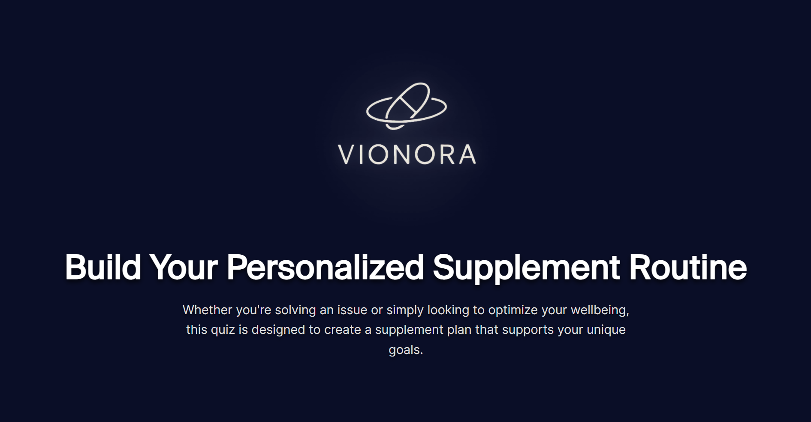
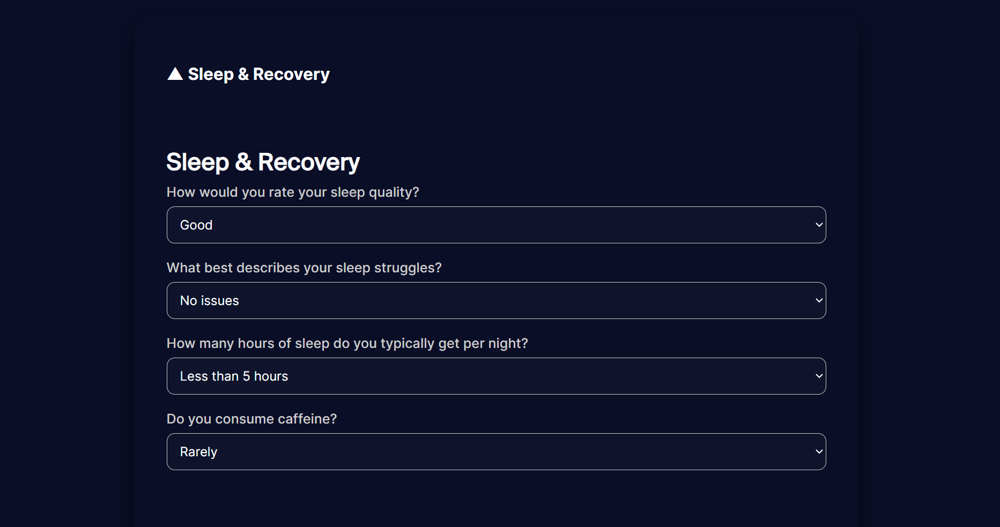
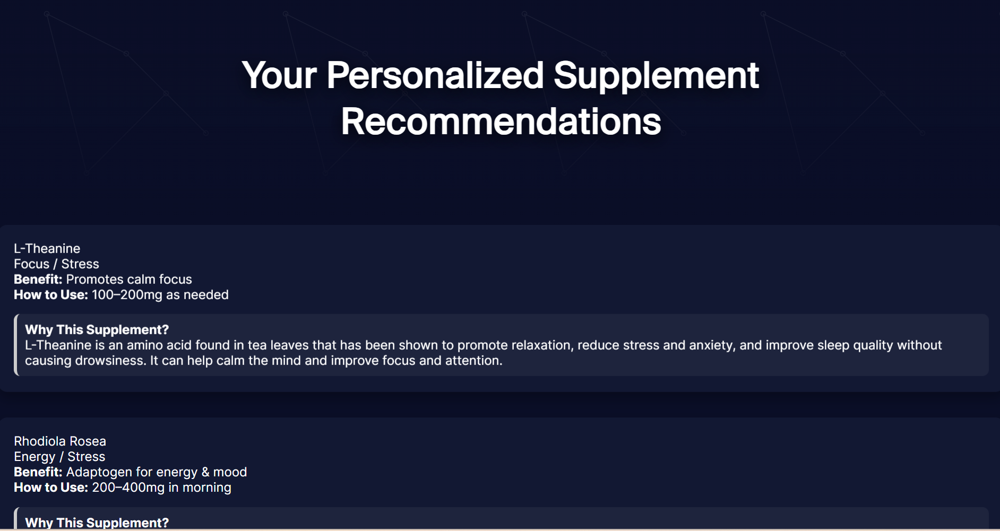

# Vionora: Personalized Supplement Recommender

Vionora is a personalized supplement recommendation quiz designed to help users optimize their health and wellness routines. By collecting user input across various lifestyle and health categories, the application uses rules-based logic to provide tailored supplement suggestions. The project merges my interest in wellness with software design, creating a real-world application that feels both purposeful and professionally presented.

## Goal & MVP

Goal: Help users discover science-backed supplements aligned with their specific goals — from improving sleep and managing stress to supporting digestion and skin health.

Minimum Viable Product (MVP):

- A dynamic web app built with Flask

- A user-friendly quiz interface with styled HTML/CSS and JavaScript

- Personalized results based on user input

Stretch Goals (for future versions):

- AI-driven recommendations

- User accounts and data storage

- Supplement brand integration (affiliate links, APIs)
## How it Works

1. Frontend:

- Clean, luxury-inspired design with a dark mode theme

- Responsive quiz interface styled with custom CSS

- JavaScript functionality for expand/collapse sections to improve UX

2. Backend:

- Built with Python using the Flask framework

- Uses POST requests to collect quiz data and process logic

- Rules-based logic determines supplement recommendations based on input

- Results are dynamically rendered on a styled results page

3. Data:

- Recommendations include: supplement name, use case, benefit, dosage, and science-based explanation

- All logic is contained in a Python dictionary and processed on form submission

## Screenshots

###  Home Page with Logo and Description

###  Quiz Example – Sleep & Recovery Section

###  Results Page with Tailored Recommendations

## Technologies Used

- Python 3

- Flask

- HTML5 / CSS3

- JavaScript (Expand/Collapse Toggle)

- Custom Fonts and Assets
## Project Evolution

- Started with a basic HTML/CSS form and static logic

- Integrated Flask backend for form processing and dynamic routing

- Added JavaScript to enhance user experience

- Evolved the UI with brand elements (logo, typography, background)
## Attribution

- All code written by Delfina de Prat Gay

- Logo and brand assets designed by Delfina

- Molecule background via open-source SVG pattern, lightly modified

- Icons and visuals used under fair use or open license
## Why This Matters

This project bridges health, personalization, and software development. It's not just a quiz — it reflects how digital tools can empower users to make informed, customized wellness choices. It also serves as a professional-level portfolio piece, showcasing technical and design skills in tandem.